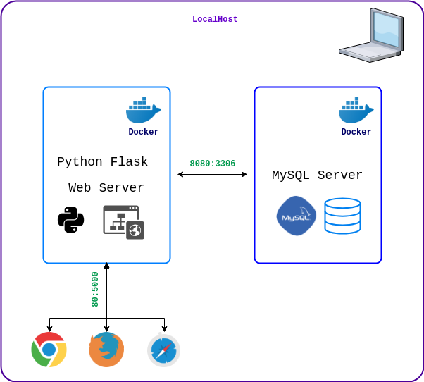
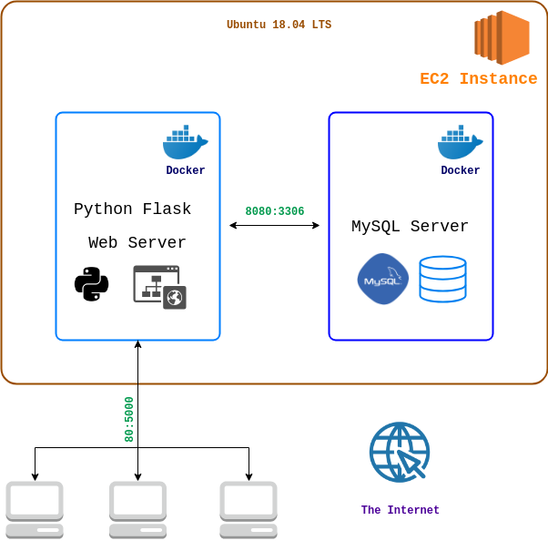

# The Python Flask - MySQL Stack

This is a guide to setting up Flask with MySQL using Docker.

- [Overview of Working Components](#overview-of-working-components)
- [Install Docker](#install-docker)
- [Setup](#setup)
- [Useful Docker Commands](#useful-docker-commands)

## [Overview of Working Components](#overview-of-working-components)

**On your machine:**



**On the deployment server:**

> The [setup process described here](#setup) for your local machine is the same process used on the EC2 (Elastic Cloud Compute) deployment server.
>
> You're essentially mimicking the deployment server on your local machine 💻



Users that have access to deployment server:  
- [@cherylfong](https://github.com/cherylfong)
- [@chirag3103](https://github.com/chirag3103)

### Why Docker?
The use of Docker is to virtualize the same environment as the server and as well as the team's development environment.

Virtualization is one way to reduce the amount of errors during development, such as environment inconsistencies. Docker containers are light-weight as compared to a full virtual machine (WM), and will take up less CPU power and memory space.

## [Install Docker](#install-docker)

Install **Docker Desktop** for [Windows](https://docs.docker.com/docker-for-windows/install/) or [Mac OS](https://docs.docker.com/docker-for-mac/install/).

Installation for [Fedora](https://docs.docker.com/install/linux/docker-ce/fedora/), [Ubuntu](https://docs.docker.com/install/linux/docker-ce/ubuntu/) and [Linux OS(s)](https://docs.docker.com/install/)

Although the [post-installation steps for Linux](https://docs.docker.com/install/linux/linux-postinstall/) is optional, it is highly recommended.

**Docker Compose** is already included with Docker Desktop Windows and Mac OS. Follow [this guide](https://docs.docker.com/compose/install/) to download Docker Compose for **Linux**.

> Rebooting your machine is highly suggested.

## [Setup](#setup)

Have a copy of the repository locally on your computer i.e. workstation.

In a directory of your choice save the repository by running:

`git clone https://<github-usenrname>:<github-password>@github.com/CSC-648-SFSU/csc648-sp19-team08.git`  

*Do not include the `<` `>` brackets above.*

Go into the repository directory:

`cd csc648-sp19-team08`

From within that directory, run the following commands to start the development stack:

`git status` should show that you are on the `master` branch.

Copy the contents of this `Dockerfile`:

```yaml
# Flask recommends:
# Latest version of Python 3. Flask supports Python 3.4 and newer, Python 2.7,
# and PyPy.
FROM python:latest

RUN pip install --upgrade pip

RUN pip install \
Flask \
mysql-connector

# create directory if not available and set as working directory
WORKDIR /web

# Do not use for production
# http://flask.pocoo.org/docs/1.0/config/
#
ENV FLASK_ENV=development

# Specifies port to listen
# Default for Flask framework
EXPOSE 5000

CMD python index.py
```

Save it as `Dockerfile`

Copy the contents of this `docker-compose.yml` file:

```yaml
version: '3'
services:
  web:
    build: .
    ports:
      - "80:5000"
    links:
      - db
    volumes:
      - ./web:/web
  db:
    image: mysql:5.7
    ports:
      - "8080:3306"
    volumes:
      - ./db:/docker-entrypoint-initdb.d/
    environment:
      - MYSQL_ROOT_PASSWORD=${DB_PSSWRD}
```

Save it as `docker-compose.yml`

> Notes:
>
> `build:` `.`
>
> This directive indicates that the `web` container will be built from the `Dockerfile` in the current directory of where the `docker-compose.yml` is .
>
> `volumes:`
>
> This directive indicates that the directory `/web` relative to the `docker-compose.yml` file would be mounted onto the web container's `/web` directory.
>
> This also applies to the db container, where the `db` directory i.e. relative to the `docker-compose.yml` file is mounted as `docker-entrypoint.initbd.d` on the container.
>
> **Reason for the above volume configuration:**
>
> Any changes made to `web` and `db` directories on your machine will be reflected in the  directories `/web` and `/db` respectively of the Flask and MySQL containers i.e. `web` and `db`.

Copy the contents of this `.env` file:

```bash
DB_PSSWRD=some-password
```
Save as `.env`.

> **The purpose of `.env` explained:**
>
> Within the `docker-compose.yml` file, specifically:
>
> `MYSQL_ROOT_PASSWORD=${DB_PSSWRD}`
>
> Whenever `docker-compose build` runs, Docker will assign `MYSQL_ROOT_PASSWORD`to the value of the environment variable named `DB_PSSWRD` found in the `.env` file.
>
> You can set `DB_PSSWRD` to any password value that you want.
>
> See a list of environment variables in the section titled "Environment Variables" of the [MySQL Official Docker Container Registry Hub](https://hub.docker.com/_/mysql#environment-variables).

To build the image and start up the containers:

`docker-compose build`  

`docker-compose up`  

or you may run the two above commands with this one line command:

`docker-compose up --build`

The output of the above command, should look something like this when `web` and `db` finish setting up:

```bash
.
.
.
web_1  |  * Serving Flask app "index" (lazy loading)
web_1  |  * Environment: development
web_1  |  * Debug mode: on
web_1  |  * Running on http://0.0.0.0:5000/ (Press CTRL+C to quit)
web_1  |  * Restarting with stat
web_1  |  * Debugger is active!
web_1  |  * Debugger PIN: 189-009-814
.
.
.
db_1   | 2019-03-02T00:03:31.459395Z 0 [Note] mysqld: ready for connections.
db_1   | Version: '5.7.25'  socket: '/var/run/mysqld/mysqld.sock'  port: 3306  MySQL Community Server (GPL)

```
The `.` dots in the output above indicate that there are many other lines of status logs by container `web_1` and `db_1`.

To stop the `web` and `db` containers, in the case of the above output, i.e. `web_1` and `db_1`:

Simply press on <kbd>ctrl</kbd> + <kbd>c</kbd>

```bash
^CGracefully stopping... (press Ctrl+C again to force)
Stopping csc648-sp19-team08_web_1 ... done
Stopping csc648-sp19-team08_db_1  ... done
```

> To start the `web` and `db` containers again, simply use `docker-compose up`.
>
> Use `docker-compose build` whenever changes has been made to the `Dockerfile` and/or `docker-compose.yml` files before using `docker-compose up`.

**On Linux and Mac OS:**

Open your browser and go to [http://0.0.0.0](http://0.0.0.0) to see the homepage.

For Mac OS users, if the above link does not work, follow the instructions for Windows below.

**Windows:**

When you've installed the Docker Toolbox in section [Install Docker](#install-docker), the installation comes packaged with Docker Machine, Docker Compose and Docker Swarm. [[src]](https://docs.docker.com/toolbox/toolbox_install_windows/)

It is also important to note that unlike Docker on Linux:

> Because the Docker Engine daemon uses Linux-specific kernel features, **you can’t run Docker Engine natively on Windows.** Instead, you must use the Docker Machine command, docker-machine, to create and attach to a small Linux VM on your machine. This VM hosts Docker Engine for you on your Windows system.

[The above also applies to Mac OS.](https://docs.docker.com/toolbox/toolbox_install_mac/)

The Docker installation for Linux does not come packaged with Docker Compose or Docker Machine or Docker Swarm. Individual installation is required.

Therefore, run:

```
docker-machine ip
```
This will output a list of running containers' IP addresses.

or `docker-machine ip <name of container>` for its specific IP.

For example if the IP was, `192.168.99.100` then open up [http://192.168.99.100](http://192.168.99.100) to see the homepage on your browser.

📖 Blog: [See on what Docker Machine, Docker Compose and Docker Swarm can do.](https://blog.codeship.com/docker-machine-compose-and-swarm-how-they-work-together/)

This section was completed with [@sharan144](https://github.com/sharan144)'s help.

## [Useful Docker Commands](#useful-docker-commands)

This section shows useful docker commands and details specific to the `web` and `db` containers.

**To remove the web and db containers:**

`docker-compose down`

Output:

```bash
Removing csc648-sp19-team08_web_1 ... done
Removing csc648-sp19-team08_db_1  ... done
Removing network csc648-sp19-team08_default
```

**To find the container name:**

Run `docker ps -a`

Expected output:

```bash
CONTAINER ID        IMAGE               COMMAND                  CREATED             STATUS              PORTS                               NAMES
9f6672178f69        dev-stack_web       "/bin/sh -c 'python …"   18 seconds ago      Up 16 seconds       0.0.0.0:80->5000/tcp                dev-stack_web_1
4493b55461e1        mysql:5.7           "docker-entrypoint.s…"   18 seconds ago      Up 17 seconds       33060/tcp, 0.0.0.0:8080->3306/tcp   dev-stack_db_1
```
**To stop a container:**

Run `docker stop <container-name>`

**To stop all running containers:**

Run `docker stop $(docker ps -aq)`

**To gain root access to the Python Flask Container:**

`docker exec -it <name of web container> bash`

> can `SOURCE` `.sql` schema when provided with the path to the `.sql` file within the container.

**To gain root access of the MySQL Server Container:**

`docker exec -it <name of db container> bash`

e.g. Container name = `dev-stack_db_1` set by docker as default, press tab to auto-complete container name for you.

For example:

```bash
ubuntu@ip-172-31-13-31:~$ docker exec -it csc648-sp19-team08_db_1 bash

root@0b60444a54b1:/# ls
bin   docker-entrypoint-initdb.d  home   media  proc  sbin  tmp
boot  entrypoint.sh               lib    mnt    root  srv   usr
dev   etc                         lib64  opt    run   sys   var

# Take note of docker-entrypoint-initbd.d directory
#
# This is the mounted volume as configured in the docker-compose.yml file.
#
#

root@0b60444a54b1:/# cd docker-entrypoint-initdb.d/

root@0b60444a54b1:/docker-entrypoint-initdb.d# ls
schema.sql

# ls should output the same files as your db folder of the repository

root@0b60444a54b1:/docker-entrypoint-initdb.d#

root@0b60444a54b1:/# mysql -uroot -p
Enter password:
Welcome to the MySQL monitor.  Commands end with ; or \g.
Your MySQL connection id is 6
Server version: 5.7.25 MySQL Community Server (GPL)

Copyright (c) 2000, 2019, Oracle and/or its affiliates. All rights reserved.

Oracle is a registered trademark of Oracle Corporation and/or its
affiliates. Other names may be trademarks of their respective
owners.

Type 'help;' or '\h' for help. Type '\c' to clear the current input statement.

mysql> show databases;
+--------------------+
| Database           |
+--------------------+
| information_schema |
| Foo                |
| mysql              |
| performance_schema |
| sys                |
+--------------------+
5 rows in set (0.01 sec)

mysql> select * from Foo.user
    -> ;
+----+----------+------------+
| id | username | password   |
+----+----------+------------+
|  1 | user1    | user1psswd |
|  2 | user2    | user2psswd |
|  3 | user3    | user3psswd |
+----+----------+------------+
3 rows in set (0.01 sec)

mysql> exit
Bye
root@0b60444a54b1:/# exit

# the exit command exits out of the db container
```

>
> To see how the database and the table was created, access the files stored in the `db` directory.
>

**To gain access to the MySQL Command Line Interface (CLI):**

With root access of the MySQL container run:

`mysql -uroot -p`

When prompt for password:

Use the password set in the `.env` file located in the root level of the repository, i.e. the value of `DB_PSSWRD`.

**To remove a Container:**

Run `docker ps -la` to find a list of docker container processes container.

To remove one or more containers:

Run `docker rm <container-name1> <container-name2> <container-nameN>`

**To free up memory used by volumes:**

`docker volume prune`

**To remove dangling containers:**

e.g. containers with the tag `<none>`. To see containers with the tag `<none>` Run `docker images`.

`docker system prune`
