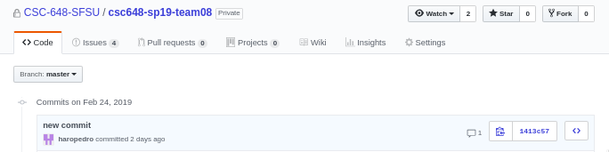

# Git + GitHub

This document details **best practices** and the general **work flow** of contributing
to this repository.


- [General Contributing Guide](#general-contributing-guide)
- [Why bother following the Contributing Guide?](#why-bother-following-the-contributing-guide)
- [Issues](#issues)
- [Pull Requests](#pull-requests)
- [Commits](#commits)
- [Branches](#branches)

## [General Contributing Guide](#general-contributing-guide)

### Step 1 | Checkout Master Branch

Use `git status` to check if you are already on the `master` branch.  

**To change branches** i.e. change to `master` branch:

Run `git checkout master`.  

🐇 When it comes to git, `git status` is your best friend.

### Step 2 | Update Master to Match Repository (i.e. Remote) Master Branch

Always check to make sure that your `master` branch on your local machine, is up to date with the `master` branch on GitHub.

For example:  

The `git log` on your `master` branch should match with the commits on the [remote master](https://github.com/CSC-648-SFSU/csc648-sp19-team08/commits/master).

This will make sure that your master branch will contain the latest merges.

**To update your `master` on your machine (local)**:

Run `git pull --rebase origin master`  

If that does not work:

Run `git reset --hard origin/master`

> ⚠️ Be on the `master` branch before running `git reset --hard origin/master`.

### Step 3 | Create a New Branch from the Master Branch

On the `master` branch, run:

`git branch <name of your new branch>`

Use the [Branches](#branches) section of this document format the name of the branch accordingly. Meaningful and descriptive names is always best. 😃


### Step 4 | Switch from the Master Branch to your New Branch

Run `git checkout <name of your new branch>`

> Note:  
> Step 3 and 4 can be combined with `git checkout -b <name of your new branch>`

### Step 5 | You are Ready to Develop

At this stage, you can make changes to files as needed.

### Step 6 | Selecting What to Add

**Method 1: Adding All Files**

To add all files, go to the root of the repository and run:  

`git add .`

> Note: the `.` indicates here. The command simply means, add file changes from this directory onwards.

**Method 2: Add Specific Files**

Run `git add <name of file 1> <name of file 2> <name of file N>`

**Method 3: Add Files by Patches**

You can add specific sections of a file change.   

Suppose you have `file-ex1.txt`, and `originally` it had:  

```txt
I like weekends.
```

And you've made the following `changes`:

```txt
I am dog.

I like weekends.

I like cake.
```

Running `git add -p file-ex1.txt` allows you to choose either `I am dog` or `I like cake` or **both** to be added to a commit.


### Step 7 | Commit your File changes

Run `git commit`, and this will open a text editor on your terminal.

This is your chance to make a **meaningful commit title and message** about your **specific file changes**. 📝

You can change the type of editor that git opens by running:

`git config --global core.editor "vim"`

OR

`export GIT_EDITOR=vim`

You can also set git to open Visual Studio Code or Atom, see [src](https://help.github.com/en/articles/associating-text-editors-with-git).


### Step 8 | Push Your Commit to Your Local Branch and its Corresponding Remote Branch

Still being on the branch that you've created in step 3, and once you're ready to push all your commits to GitHub (remote):

Run `git push --set-upstream origin <name of your branch from step 3>`

> Note:  
> The argument `origin` is the URL to the repository.
>
> The argument `<name of your branch from step 3>` is the name you want to set for the remote branch.
> Most times, it's just easier to have your local branch name match with the remote branch name.

⚠️ The above command only needs to be executed once. Any **future pushes** to the remote branch can be executed with:

`git push`

### Step 9 | Done with Developing? Time to Open a Pull Request (PR)

When you're done with all the changes that you need doing, go to our [GitHub repository](https://github.com/CSC-648-SFSU/csc648-sp19-team08):

Then select the [Pull Request](https://github.com/CSC-648-SFSU/csc648-sp19-team08/pulls) tab.

Select the green `New pull request` button.

Compare your branch (created in step 3) with the `master` branch on Gitub (i.e. remote)

> In the choose head branch field, type the name of your branch created in step 3.

  

**Review your commits and your file changes.**

> Before Creating the Pull Request, include a meaningful title and a brief description or linking to an existing issue is sufficient, and tag reviewers.
>
> See the section on [Pull Requests](#pull-requests) on who to tag for reviewers.

**Select the green `Create pull request` button to complete this process.**

### Step 10 | Have Your Pull Request (PR) Reviewed

As soon as your PR is submitted, please go ahead and ping the front-end or back-end lead or the team lead to start the reviewing process. _Especially, if your PR hasn't gotten any attention for more than 24hrs._

**During the reviewing process, your code will be evaluated for:**

1. Implementation correctness.
  - Does the code do what it is supposed to do?
  - Does it work on the local development stack?
    - Ideally, your branch is copied by a reviewer and tested on their local dev stack.
2. Correct code formatting
  - Meaningful variables
  - no extra spaces
3. Committing the right files?
  - Commits should not include the `.env`, `docker-compose.yml` and `Dockerfiles` files.
    - See [HACK.md](HACK.md) for more information.

**If Any of the Above 3 Does Not Satisfy**:

You will need to make the changes as according to the reviewer's comments, this will include repeating steps 5 to 8.

> Note:  
> Do not open a new PR i.e. do not do repeat step 9 if there are more changes needed to be made after reviewing.

⚠️ The changes you made to the branch, the one that you've opened with the PR on step 9 earlier **will reflect** on the page where the review takes place.

Once you've made the changes as according to the review comments, **ask for another round of reviews**.

### Step 11 | Receive Your Pull Request (PR) Approval

So far you've done the following (summarized):

1. Created a branch off an up-to-date `master`
2. Committed code to your branch
3. Pushed your branch locally and remotely
4. Submitted a PR
5. Had Reviews in your PR
6. Fixed your code as according to the review comments in the PR
7. Asked another round of reviews

**8. You finally get a 👍 from all the reviewers.**

When No. 8 happens, the GitHub Master will `merge` your commits from your branch created in step 3 onto the `master` on GitHub.

### Step 12 | Celebrate & Start All Over Again

Find or create a GitHub Issue to work on and start this process all over again. 🎉

## [Issues](#issues)

📝 `Task`: Select *Task Report Template*

Most issues on our GitHub will be task labeled issues. A task is something that
needs to be completed e.g. before the milestone deadline.

🐞 `Bug`: Select *Bug Report Template*

This is to report any bugs or unusual behavior. All bugs need to be reported
even if it does not cost the team any points. Reporting bugs is useful for
further implementation that may or may not be related to the bug.

[Welcomes requests for template
updates](https://github.com/CSC-648-SFSU/csc648-sp19-team08/blob/master/.github/ISSUE_TEMPLATE).

## [Pull Requests](#pull-requests)

The pull requests for implementation or bug fixes needs to be reviewed.

**Review a PR General Guidelines:**

One other team member (not author of the the issue) must approve
implementation plans and code.

If front end person, then someone from front end team approves (add as suggested
reviewer).
If the implementation needs to communicate with functionality via back end then
someone from back end should review as well.

> ⚠️ The pull request is considered ready for merge as soon as all reviewers have agreed that the PR code/file changes are error-free and has the right/agreed-upon implementation.


## [Commits](#commits)

Committing your code is the best part of logging your changes, this is your time to be articulate.

> Note:  
> The titles of the commit message should have an **imperative** tone.  
>
> [See this popular blog on how to create great commit messages](https://chris.beams.io/posts/git-commit/).

**Message Format**

```
[TITLE] all commit titles must have a scope and be no more than 72 characters '/n'

[Body] Must be as descriptive as possible
```

**Commit message example:**

```
implement pagination for search listing
# This is a newline
Allows the user to go to the next page of search results by clicking next button.  
```

*Note: The title only has 39 characters and the body can be as long as necessary.*

## [Branches](#branches)

`master` - force push protected and will require review before merge. [src](https://help.github.com/articles/configuring-protected-branches/)

Please prefix your branch with one of the following:

`frnt-` - features/implementation that are user facing or aesthetically related.

`bck-` - network, redirection, directory creation, MySQL etc.

`docs-` - all documentation amendments and improvements.

Branch name example: `docs-amend-standup-sect-handbook`


## [Why bother following the Contributing Guide?](#why-bother-following-the-contributing-guide)

This is so that we don't develop directly on the `master` branch and so that we can minimize file change conflicts when developing. It is also easier to keep track of changes from more than 1 person.

**Take the following for example:**



This is just simply bad practice:

1. **There isn't a descriptive commit message**
2. **This commit was made directly on the `master` branch.**

The goal is to work on our own branches and not have to worry about the working code on the master.

4. Additionally, _this commit didn't go through a code review._

Although there's nothing particularly wrong with the implementation. This commit missed out an important change such as changing the redirection URL to match author's name correctly.


**Looking closely at the comment in the picture above, there was an open issue to address the problem that the author was trying to resolve.**

5. **When addressing a fix or bug, look for a related issue and it to link your PR.**

Checkout the conversation on [issue #14](https://github.com/CSC-648-SFSU/csc648-sp19-team08/issues/14)

**Take a look at this commit history, or `git log` output:**


Can you tell what went on during `new addition to repo` or `add files via upload`?

6. **It is difficult to understand what is going on by looking at the commit titles.**

**By following the format in the [Branches](#branches) section:**

The `...` button will show up on the commit history log and **clicking it allows the user to see more details about a particular commit**.  


